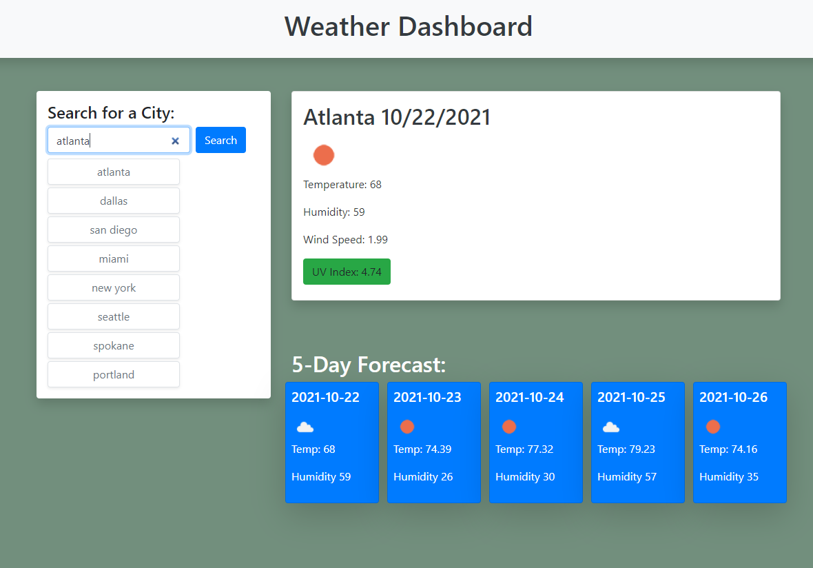

# Weather Dashboard
---
## Week 6 Homework Assignment

This is a weather dashboard using the OpenWeather One Call API to retrieve weather data for cities and features dynamically updated HTML and CSS.  Local storage used to store persistent data for cities searched.
* The dashboard includes form inputs
* The user is presented with curent and future forecasts of the city they have searched for and then it's added to the search history
* The user is presented with the city name, the date, an icon representation of the weather conditions, the temperature, the humidity, the wind speed, and the UV index
* The user is presented with a color that indicates whether the UV index conditions are favoable, moderate, or severe
* The user is presented with a 5-day forecast that displays the date, an icon representing the weather conditions, the temperature, and the humidity
* When the user clicks on a city from the search history they are then presented with the current and future conditions for that city

## Example
The following image shows the web application's appearance and functionality.

https://danpgolden.github.io/weather_dashboard/